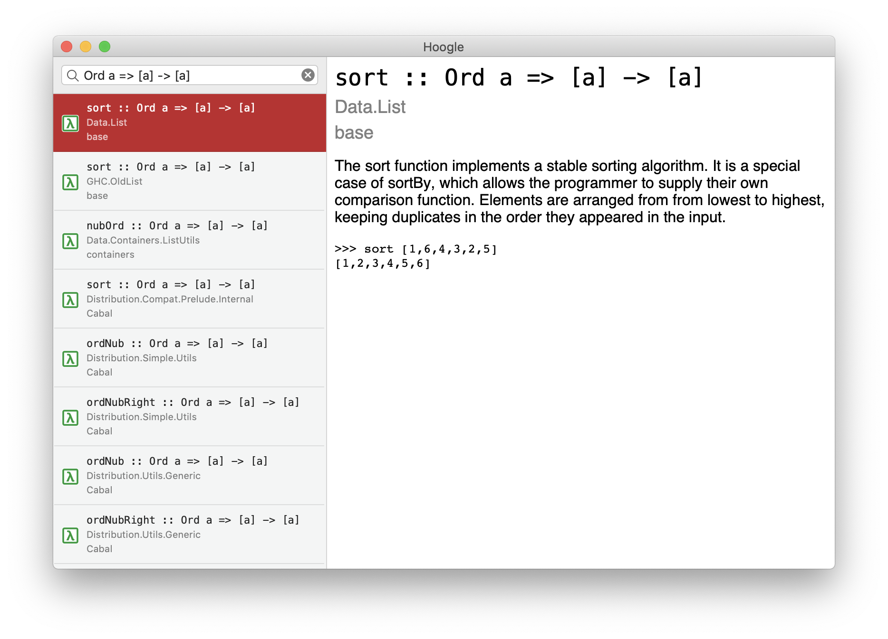

#  Hoogle

A [Hoogle](https://hoogle.haskell.org/) client for macOS.

## Features

 - Search Hoogle using its API.
 - Display a list of results and shows documentation.

## Planned Features / TODO list

 - Load more results when the sidebar is scrolled to the bottom.
 - Open relavent pages when type signature/module/package is clicked on in the detail view.
 - Collect results with the same type signature and docs together, showing a list of modules and packages which they come from.
 - Make a menu-bar interface so it can be used more quickly.
